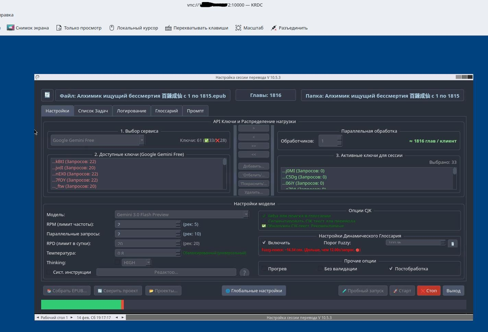

# Неофициальный порт программы gemini-translator

Этот репозиторий содержит Docker-сборку (неофициальный порт) программы **gemini-translator**, созданной Александром. Оригинальные файлы и обсуждение доступны в Telegram‑канале: [https://t.me/novel_ranobe/1135973](https://t.me/novel_ranobe/1135973)
Для неофициального мода https://github.com/primalrin/translatorFork_MOD/ тоже подходит

Инструкция предназначена для пользователей любого уровня. Все команды выполняются в терминале сервера.



---

## 🔧 Предварительные требования

- **Сервер** с Linux (Ubuntu/Debian) или любая система, поддерживающая Docker.
- Установленные **Docker** и **Docker Compose**.  
  Если не установлены:
  ```bash
  # Для Ubuntu/Debian
  sudo apt update
  sudo apt install docker.io docker-compose-plugin
  sudo systemctl enable --now docker
  ```
- **Git** (обычно уже есть, иначе `sudo apt install git`).
- Доступ в интернет.

---

##  Установка

### 1. Клонируйте этот репозиторий

```bash
git clone https://github.com/supotnitskiy/gemini-translator.git
cd gemini-translator
```

### 2. Создайте папку для файлов программы

Внутри склонированной директории выполните:

```bash
mkdir GeminiTranslator
```

### 3. Скопируйте файлы программы из Telegram

1. Скачайте архив с программой из [Telegram‑канала](https://t.me/novel_ranobe/1135973).
2. Распакуйте архив на своём компьютере.
3. Перенесите **все содержимое** распакованной папки в только что созданную папку `GeminiTranslator`.

В итоге структура проекта должна выглядеть так:

```
/НАЗВАНИЕ_РЕПОЗИТОРИЯ/
├── docker-compose.yml
├── ... (остальные файлы репозитория)
└── GeminiTranslator/
    ├── main.py
    ├── config.ini
    └── ... (другие файлы программы)
```

### 4. Создайте файл с секретными настройками (`.env`)

В корне проекта (там же, где лежит `docker-compose.yml`) создайте файл `.env` и откройте его в редакторе:

```bash
nano .env
```

Вставьте следующие строки:

```
VNC_PASSWORD=ваш_надёжный_пароль
APP_DIR=GeminiTranslator
```

- **`VNC_PASSWORD`** – пароль, который будет использоваться для подключения к VNC. Придумайте сложный пароль.
- **`APP_DIR`** – имя папки с файлами программы. Обычно оставляют `GeminiTranslator` (если вы не переименовывали её).

> **Важно!** Файл `.env` содержит конфиденциальные данные. Никогда не добавляйте его в публичные репозитории.

### 5. Создайте папку для обмена файлами

Для удобной передачи файлов между хостом и контейнером создайте папку `share` в корне проекта:

```bash
mkdir share
```

Всё, что вы положите в эту папку на сервере, будет доступно внутри контейнера по пути **`/share`**. Это удобно для загрузки исходных текстов и скачивания результатов.

### 6. Запустите контейнер

Выполните команду:

```bash
docker compose up -d
```

- `up` – запускает сервисы, описанные в `docker-compose.yml`.
- `-d` – работает в фоновом режиме.

Docker скачает необходимые образы и запустит контейнер. Проверить статус можно командой:

```bash
docker compose ps
```

Статус должен быть `Up`.

---

##  Настройка сервера (открытие порта)

Для доступа к графическому интерфейсу программы по VNC откройте порт **10000** на вашем сервере.

### Если вы используете облачный VPS

Зайдите в панель управления хостингом и добавьте правило для **входящих TCP-подключений на порт 10000**.

### Если сервер под вашим управлением (например, Ubuntu)

Используйте `ufw` (если он включён):

```bash
sudo ufw allow 10000
```

Проверьте открытые порты:

```bash
sudo ufw status
```

---

##  Работа с программой

### Подключение по VNC

1. Установите на своём компьютере любой VNC-клиент (например, [RealVNC Viewer](https://www.realvnc.com/en/connect/download/viewer/), [TightVNC](https://www.tightvnc.com/download.php) или [Remmina](https://remmina.org/)).
2. Введите адрес для подключения:  
   **`IP_вашего_сервера:10000`**  
   (замените `IP_вашего_сервера` на фактический IP или домен).
3. Когда клиент запросит пароль, введите тот, который вы указали в `.env` (`VNC_PASSWORD`).

После подключения вы увидите графический интерфейс программы **gemini-translator**. Далее работайте как обычно.

### Использование папки `share`

- На сервере: папка `share` находится рядом с `docker-compose.yml`.
- Внутри контейнера: эта папка доступна по пути **`/share`**.
- **Чтобы передать файл в программу**, просто скопируйте его в папку `share` на сервере. В контейнере он появится автоматически.
- **Чтобы сохранить результат**, внутри программы сохраняйте файлы в директорию `/share`. После этого они окажутся в папке `share` на сервере – вы сможете их скачать.

 
---

## Обновление программы

Когда Александр публикует новую версию в Telegram‑канале, выполните следующие шаги:

1. **Скачайте новые файлы** программы из Telegram.
2. **Замените содержимое** папки `GeminiTranslator` новыми файлами (просто скопируйте поверх старых).
3. **Пересоберите Docker-образ** без использования кеша (чтобы гарантированно включить обновления):

   ```bash
   docker compose build --no-cache
   ```

4. **Перезапустите контейнер**:

   ```bash
   docker compose up -d
   ```

Все ваши данные в папке `share` сохранятся, так как она не пересоздаётся.

---

##   Полезные команды

- **Остановка контейнера:**  
  ```bash
  docker compose down
  ```
- **Просмотр логов:**  
  ```bash
  docker compose logs
  ```
- **Перезапуск:**  
  ```bash
  docker compose restart
  ```
- **Вход в контейнер (для отладки):**  
  ```bash
  docker compose exec gemini-translator bash
  ```
  (имя сервиса может отличаться; посмотрите в `docker-compose.yml`)

---

##  Возможные проблемы и их решение

| Проблема | Решение |
|----------|---------|
| Не удаётся подключиться по VNC | Проверьте, открыт ли порт 10000 на сервере. Убедитесь, что контейнер работает (`docker compose ps`). Попробуйте отключить брандмауэр временно для теста. |
| Файлы из папки `share` не видны внутри контейнера | Убедитесь, что папка `share` создана в корне проекта и в `docker-compose.yml` есть том, монтирующий `./share:/share`. |
| Ошибки при сборке образа | Возможно, новые файлы программы требуют дополнительных зависимостей. Проверьте, есть ли у программы инструкции по установке. |
| VNC запрашивает пароль, но не принимает | Проверьте, что в `.env` нет лишних пробелов и кавычек. Пересоздайте контейнер после изменения `.env`. |
 
